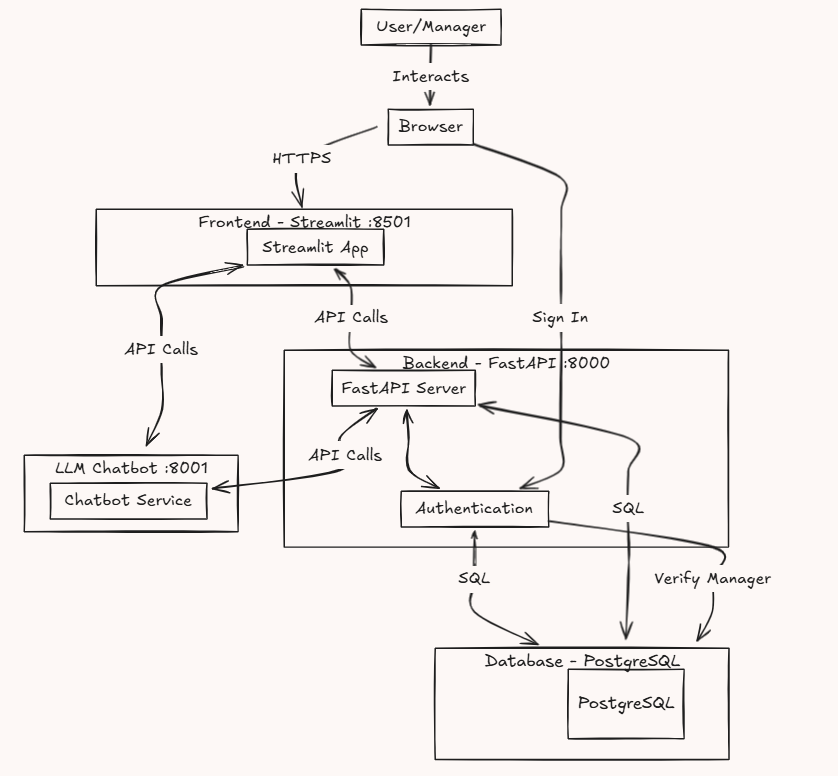

# Welcome to Cinema Management System 📽️

  A microservices-based cinema management system designed for efficient movie scheduling, employee management, and branch operations, with integrated AI-powered assistance.

  [](https://fastapi.tiangolo.com)
  [](https://streamlit.io/)
  [](https://docker.com)
  [](https://gemini.google.com/chat)
</div>

The **Cinema Management System** is a full-stack application designed to streamline movie scheduling, employee management, and branch operations. Featuring a modern Streamlit frontend, a FastAPI backend, and cutting-edge technologies like LLM integration, this system provides intelligent assistance for cinema operations. Dockerized for seamless deployment, the application is built on a microservices architecture to ensure scalability and flexibility

---
## 🚀 Features
- **Movie Scheduling:** Efficiently manage screening times across multiple branches.
- **Employee Management:** Handle staff details, roles, and schedules seamlessly.
- **Branch Operations:** Oversee branch opening hours, managers, and customer service contacts.
- **LLM-Powered Assistance:** Get intelligent support for cinema operations with AI integration.
- **Microservices Architecture:** Modular FastAPI backend ensures scalability and maintainability.
- **Streamlit Frontend:** Intuitive and responsive UI for effortless management.
- **Docker Support:** Seamless deployment using Docker Compose for a hassle-free setup.
---
## 🗂️ Project Architecture



## Project Structure
```plaintext
.
└── app
    ├── README.md
    ├── __init__.py
    ├── backend
    │   ├── Dockerfile
    │   ├── app
    │   │   ├── crud.py
    │   │   ├── database.py
    │   │   ├── main.py
    │   │   ├── models.py
    │   │   ├── schemas.py
    │   │   ├── requirements.txt
    │   │   ├── test_cinema.db
    │   │   └── tests/
    │   └── llm_service
    │       ├── Dockerfile
    │       ├── __init__.py
    │       ├── app
    │       │   ├── config/settings.py
    │       │   ├── gemini.py
    │       │   ├── main.py
    │       │   ├── prompt.py
    │       │   └── utils.py
    │       └── requirements.txt
    ├── docker-compose.yml
    ├── frontend
    │   ├── Dockerfile
    │   ├── app.py
    │   ├── assets/
    │   ├── components/
    │   │   ├── login.py
    │   │   ├── sidebar.py
    │   │   └── utils.py
    │   ├── pages/
    │   │   ├── branches.py
    │   │   ├── employees.py
    │   │   └── movies.py
    │   ├── requirements.txt
    │   ├── setup.py
    │   └── tests/
    └── tests/

```
---
## 🛠️ Setting Up the Project
### Prerequisites
- Docker and Docker Compose installed.
### Step 1: Clone the Repository
```bash
git clone https://github.com/EASS-HIT-PART-A-2024-CLASS-VI/Cinema_Managment_Liat.git
cd Cinema_Managment_Liat
```
### Step 2: Build and Run Containers
```bash
docker compose up --build
```
- The backend will be available at: [http://localhost:8000](http://localhost:8000)
- The frontend will be available at: [http://localhost:8501](http://localhost:8501)

### Step 3: Use the Application
- Open the application in your browser:
  - Backend: [http://localhost:8000](http://localhost:8000)
  - Frontend: [http://localhost:8501](http://localhost:8501)
- **Login**:
  - Use the manager's first name as the username.
  - Default password: `Aa123456`.
- Navigate through the menu to:
  - **Manage Movies**: View, add, and delete movies.
  - **Manage Employees**: View, add, and delete employees (A manager can't be deleted if he is connected to a branch).
  - **Manage Branches**: View, add, and delete branches.

---

## Endpoints

### Authentication
- **POST /login**: Allows managers to log in by verifying their credentials.
  - Request Body:
    ```json
    {
      "username": "string",
      "password": "string"
    }
    ```
  - Response: A success or failure message.

### Movies Endpoints
- **GET /movies/dropdown**: Fetches a list of movie titles for dropdown menus.
- **GET /movies**: Retrieves all movies.
- **GET /movies/{movie_id}**: Retrieves a specific movie by ID.
- **POST /movies**: Adds a new movie to the database.
  - Request Body: schemas.MovieCreate.
- **DELETE /movies/{movie_id}**: Deletes a movie by ID.

### Employees Endpoints
- **GET /employees**: Retrieves all employees.
- **GET /employees/dropdown**: Fetches a list of employee names for dropdown menus.
- **GET /employees/{employee_id}**: Retrieves a specific employee by ID.
- **POST /employees**: Adds a new employee to the database. If the role is "Manager," credentials are added to the permissions table.
  - Request Body: schemas.EmployeeCreate.
- **DELETE /employees/{employee_id}**: Deletes an employee by ID.

### Branches Endpoints
- **GET /branches**: Retrieves all branches.
- **GET /branches/dropdown**: Fetches a list of branch names for dropdown menus.
- **GET /branches/{branch_id}**: Retrieves a specific branch by ID.
- **POST /branches**: Adds a new branch to the database.
  - Request Body: schemas.BranchCreate.
- **DELETE /branches/{branch_id}**: Deletes a branch by ID.

---


