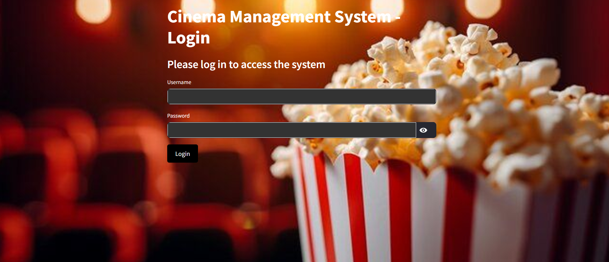

# Welcome to Cinema Management System 📽️
[](https://fastapi.tiangolo.com)
[](https://streamlit.io/)
[](https://docker.com)
[](https://gemini.google.com/chat)

A microservices-based cinema management system designed for efficient movie scheduling, employee management, and branch operations, with integrated AI-powered assistance.

The **Cinema Management System** is a full-stack application designed to streamline movie scheduling, employee management, and branch operations. Featuring a modern Streamlit frontend, a FastAPI backend, and cutting-edge technologies like LLM integration, this system provides intelligent assistance for cinema operations. Dockerized for seamless deployment, the application is built on a microservices architecture to ensure scalability and flexibility.

## 📋 Table of Contents
- [Features](#-features)
- [Project Architecture](#-project-architecture)
- [Demo](#-demo)
- [Prerequisites](#-prerequisites)
- [Setting up the Project](#-setting-up-the-project)
- [Docker Deployment](#-docker-deployment)
- [First-Time Setup](#-first-time-setup)
- [API Endpoints](#-api-endpoints)
- [LLM Microservice Features](#-llm-microservice-features)
- [Port Configuration](#-port-configuration)
- [Testing](#-testing)
- [Author](#-author)

## 🚀 Features
- **Movie Scheduling:** Efficiently manage screening times across multiple branches.
- **Employee Management:** Handle staff details, roles, and schedules seamlessly.
- **Branch Operations:** Oversee branch opening hours, managers, and customer service contacts.
- **LLM-Powered Assistance:** Get intelligent support for cinema operations with AI integration.
- **Microservices Architecture:** Modular FastAPI backend ensures scalability and maintainability.
- **Streamlit Frontend:** Intuitive and responsive UI for effortless management.
- **Docker Support:** Seamless deployment using Docker Compose for a hassle-free setup.

## 🗂️ Project Architecture


```plaintext
.
└── app
    ├── README.md
    ├── __init__.py
    ├── backend
    │   ├── Dockerfile
    │   ├── app
    │   │   ├── crud.py
    │   │   ├── database.py
    │   │   ├── main.py
    │   │   ├── models.py
    │   │   ├── schemas.py
    │   │   ├── requirements.txt
    │   │   ├── test_cinema.db
    │   │   └── tests/
    │   └── llm_service
    │       ├── Dockerfile
    │       ├── __init__.py
    │       ├── app
    │       │   ├── config/settings.py
    │       │   ├── gemini.py
    │       │   ├── main.py
    │       │   ├── prompt.py
    │       │   └── utils.py
    │       └── requirements.txt
    ├── docker-compose.yml
    ├── frontend
    │   ├── Dockerfile
    │   ├── app.py
    │   ├── assets/
    │   ├── components/
    │   │   ├── login.py
    │   │   ├── sidebar.py
    │   │   └── utils.py
    │   ├── pages/
    │   │   ├── branches.py
    │   │   ├── employees.py
    │   │   └── movies.py
    │   ├── requirements.txt
    │   ├── setup.py
    │   └── tests/
    └── tests/
```
---

## 🎥 Demo

<a href="https://youtu.be/H_tabs6GUPk" target="_blank">
  
</a>

---
### 🛠️ Prerequisites
- Docker and Docker Compose installed
- Python 3.9+
- Git

## 🏗️ **Setting up the Project**

To enable **Google Gemini AI**, you must create an API key from [Google AI Studio](https://aistudio.google.com/app/apikey).

Then, create a `.env` file in the root directory and fill it with:
```bash
    GEMINI_API_KEY=<YOUR_API_KEY>'
``` 

Ensure `.env` is **excluded from version control** by adding it to `.gitignore`.

Clone the repository:
```bash
git clone https://github.com/EASS-HIT-PART-A-2024-CLASS-VI/Cinema_Managment_Liat.git
cd Cinema_Managment_Liat
```   
## 🐳 Docker Deployment

To deploy all services, run:

`docker-compose up --build` 

This will start **all microservices** (Backend, Frontend, Database, and AI Service).

Once running:

- Frontend: `http://localhost:8501`
- Backend : `http://localhost:8000`
- Swagger LLM Service: `http://localhost:8001/docs` 

## 🔑 First-Time Setup
Since the database is initially empty, you need to create a manager account to log in.

After starting all services with Docker Compose, create a manager using the following curl command:

```bash
curl -X POST http://localhost:8000/employees \
  -H "Content-Type: application/json" \
  -d '{
    "personal_id": "123456789",
    "phone_number": "0501234567",
    "first_name": "Admin",
    "last_name": "Manager",
    "birth_year": "1990-01-01",
    "start_year": "2020-01-01",
    "role": "Manager",
    "city": "Test City",
    "salary": 50000.0
  }'
```

Alternatively, you can use Swagger UI at [http://localhost:8000/docs](http://localhost:8000/docs) to send the POST request to the `/employees` endpoint with the above JSON data.

### **Login:**
- Use the manager's first name (e.g., **"Admin"**) as the username.
- **Default password:** `Aa123456`

---

## 📚 API Endpoints
The FastAPI backend provides RESTful endpoints for managing the system:

### 🔑 Authentication Endpoints

#### **POST `/login`** - Allows managers to log in by verifying their credentials.

**Request Body:**
```json
{
  "username": "string",
  "password": "string"
}
```

#### **POST `/logout`** - Log out a user from the system.

---

### 🎮 Movies Endpoints

- **GET** `/movies` - Retrieve all movies
- **POST** `/movies` - Add a new movie
- **DELETE** `/movies/{movie_id}` - Delete a movie
- **GET** `/movies/sorted` - Get movies sorted by critics' ratings
- **GET** `/movies/dropdown` - Retrieve a list of movie titles

---

### 👥 Employees Endpoints

- **GET** `/employees` - Retrieve all employees
- **POST** `/employees` - Add a new employee
- **DELETE** `/employees/{employee_id}` - Delete an employee
- **GET** `/employees/sorted` - Get employees sorted by salary
- **GET** `/employees/birthdays` - Retrieve employees with birthdays in the current month
- **GET** `/employees/dropdown` - Retrieve a list of employee names

---

### 🏢 Branches Endpoints

- **GET** `/branches` - Retrieve all branches
- **POST** `/branches` - Add a new branch
- **DELETE** `/branches/{branch_id}` - Delete a branch
- **GET** `/branches/dropdown` - Retrieve a list of branch names

---

### 🎭 Schedule (Not an Endpoint)
Each branch has a screening schedule that includes:

- Movie title
- Hall number
- Showtime
- Duration

Schedules are stored per branch and update when a movie is deleted.

---

## 🤖 LLM Microservice Features
The Cinema Management System integrates Google Gemini AI to assist with various management tasks. The LLM provides intelligent guidance and operational support for the following features:

### 🎮 Movie Management
- Retrieve movie details, including genre, director, duration, and ratings.
- Get sorted movie lists based on critics' ratings.
- Guide users on how to add or delete movies in the system.

### 👥 Employee Management
- Retrieve a list of all employees with relevant details.
- Provide guidance on adding new employees with necessary information.
- Retrieve employees sorted by salary.
- Retrieve a list of employees with birthdays in the current month.

### 🏢 Branch Management
- Retrieve all cinema branch details.
- Guide users on how to add or delete branches.
- Provide customer service contact details for each branch.

### 🎭 Screening Schedule Management
- Guide users on how to assign movies to screening times in different branches.
- Prevent scheduling conflicts based on movie duration and branch hours.
- Assist with managing existing screenings in the **Branch Management** section.

### 📌 System Navigation Assistance
Provide step-by-step guidance on using the system, including:
- Switching between **Movies, Employees, and Branches** sections.
- Using the sidebar for filtering and sorting options.
- Accessing employee birthday lists via the **"Birthdays 🎂"** button.
- Managing screenings via the **"Manage Screenings 🎭"** button.

---

## 🚫 General System Restrictions
- **Only managers** can access the system.
- Employees **cannot log in** or modify system data.

📌 **The LLM ensures all responses are professional, accurate, and strictly related to cinema management.**

---

## 🛠️ Port Configuration

### **Frontend**
- **Port:** `8501`
- **URL:** [http://localhost:8501](http://localhost:8501)

### **Backend API**
- **Port:** `8000`
- **URL:** [http://localhost:8000](http://localhost:8000)
- **Swagger UI:** [http://localhost:8000/docs](http://localhost:8000/docs)

### **LLM Chatbot**
- **Port:** `8001`
- **URL:** [http://localhost:8001](http://localhost:8001)
- **Swagger UI:** [http://localhost:8001/docs](http://localhost:8001/docs)

---

## 🥾 Testing

### **Backend Tests**
Run tests from the project root:

```bash
# Run all tests
pytest tests/

# Run specific test files
pytest tests/test_routes.py
```

#### The backend tests cover:
- API endpoints functionality
- CRUD operations
- Authentication
- Data validation
- Error handling

### **Frontend Tests**
Run tests from the frontend directory:

```bash
cd frontend
pytest tests/
```

#### Frontend tests validate:
- Component rendering
- Page navigation
- User interactions
- API integration

### **Integration Tests**
Test the entire system including all services:

```bash
# From project root
pytest -m integration
```

---

## 👨‍💻 Author

- **Name:** Liat Simhayev
- **GitHub:** [liatsimhayev](https://github.com/liatsimhayev)
